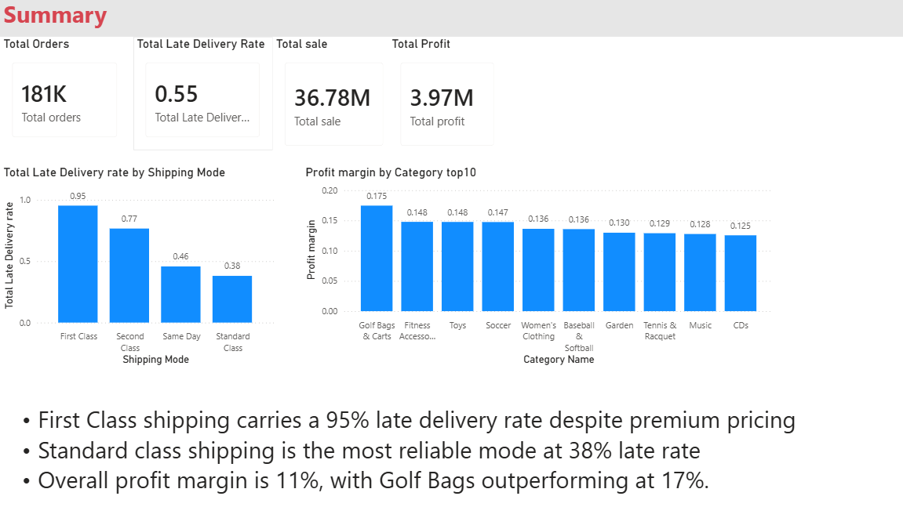
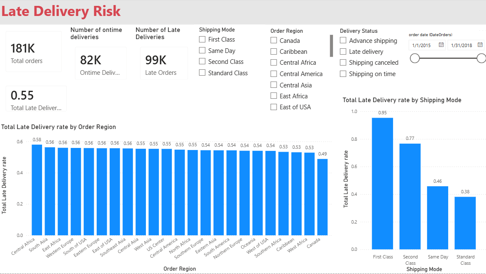
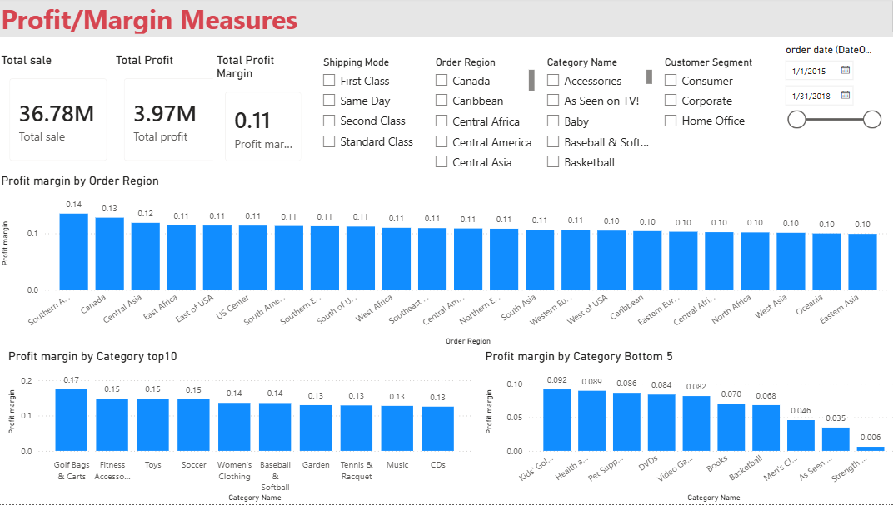

# Supply Chain Analytics Dashboard (Power BI)

## Project Overview
This project analyzes delivery performance and profitability using the DataCo Supply Chain dataset. The dashboard was built in Power BI using a star schema data model and interactive visualizations.

## Objectives
- Analyze delivery performance
- Identify late delivery risk
- Evaluate profitability by product, region, and customer segment
- Create an interactive business dashboard

## Data Model
Star Schema:
- Fact_Orders
- Dim_Customer
- Dim_Product
- Dim_Location
- Dim_Date

## Dashboard Features
- Executive KPI cards
- Delivery Risk Analysis
- Profitability Analysis
- Interactive slicers
- Regional performance insights

## Tools Used
- Power BI
- Power Query
- DAX
- Excel

## Repository Contents
- Power BI report (.pbix)
- Dashboard screenshots
- Project documentation

## Author
Mahmoud Shiri

## Dashboard Preview

### Executive Summary

### Delivery Risk Analysis

### Profitability Analysis

